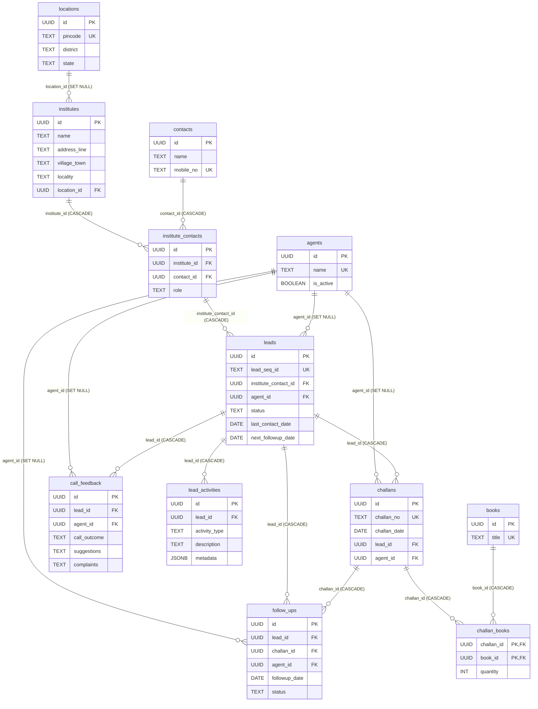

# Database Schema Analysis & ER Diagram

Here is a detailed breakdown and entity-relationship diagram of the newly refactored 5NF database schema, along with an architectural analysis.

## Entity Relationship Diagram (ERD)

## Relationship & Integrity Verification

> [!TIP]
> **Cascade Rules are Perfectly Defined:** All core relationships gracefully handle data deletion without leaving orphans.
> - Deleting a `lead` cascades to `challans`, `follow_ups`, `lead_activities`, and `call_feedback`.
> - Deleting a `contact` or `institute` cascades to the junction table `institute_contacts`, which then cascades to `leads`.
> - If an `agent` or `location` is deleted, it gracefully `SET NULL` so historical data is retained.

### Dependency Graph
The schema forms a strict Directed Acyclic Graph (DAG) with **no circular dependencies**:
`locations` & `contacts` ➡️ `institutes` ➡️ `institute_contacts` ➡️ `leads` ➡️ `challans`, `follow_ups`, `activities`.

## Optimization Opportunities

While the normalization is mathematically sound (up to 5NF), there are a few areas for optimization in the real world:

### 1. Missing Indexes
The following indexes should be added to speed up dashboard queries filtering by representative:
- `CREATE INDEX idx_leads_agent ON leads(agent_id);`
- `CREATE INDEX idx_follow_ups_agent ON follow_ups(agent_id);`

### 2. Redundant Indexes
- `idx_institute_contacts_inst` on `institute_contacts(institute_id)` is **redundant**. The `UNIQUE(institute_id, contact_id)` constraint automatically creates a composite B-Tree index, which inherently optimizes lookups for the first column (`institute_id`). You can safely drop `idx_institute_contacts_inst`.

### 3. Redundant / Obsolete Fields
- **`call_feedback.created_by (TEXT)`**: This is leftover from the denormalized schema. Since we now properly link to `agents` via `agent_id UUID`, the `created_by` text field can be safely dropped to simplify the table.
- **`follow_ups.challan_id`**: Currently, a follow-up points to both a `lead_id` and optionally a `challan_id`. Since a challan fundamentally belongs to a lead, this is slightly denormalized, but heavily advantageous for application logic (knowing exactly which delivery prompted the follow-up) so it should remain.

### 4. Normalization vs Convenience (Data Entry)
Because we are in 5NF, writing a single "Challan" from the frontend requires sequentially writing to 7 tables. If insert performance ever becomes an issue under heavy load, you could implement a PostgreSQL `RPC` (Remote Procedure Call) function to handle the entire insertion transaction atomically in a single network trip instead of chaining them via the Next.js API.
